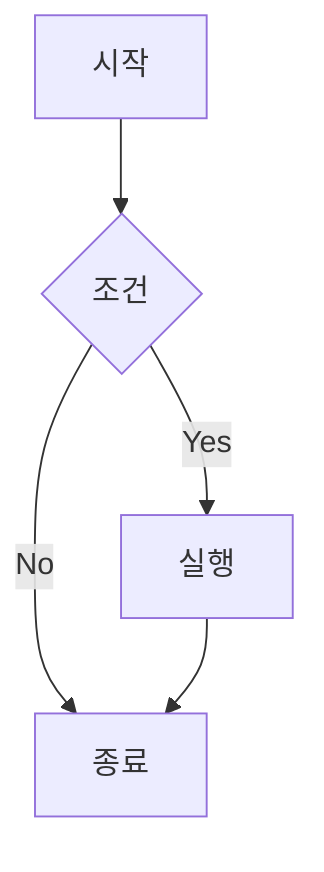
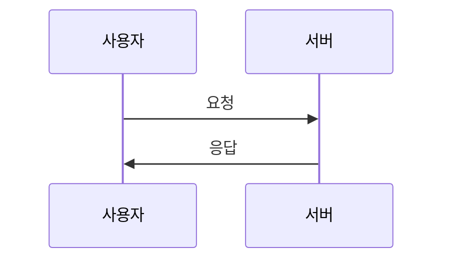

# Typora 스니펫 모음

Typora에서 빠르게 사용할 수 있는 유용한 스니펫들입니다.

## 📋 Front Matter 템플릿

```yaml
---
title: 제목을 입력하세요
date: 2026-02-10 20:00:00 +0900
categories: [카테고리1, 카테고리2]
tags: [태그1, 태그2]
image:
  path: /assets/img/posts/2026-02-10-slug/cover.jpg
  alt: 이미지 설명
pin: false
math: false
mermaid: false
---
```

## 🎨 자주 사용하는 요소

### 정보 프롬프트

```markdown
> 이것은 팁입니다!
{: .prompt-tip }

> 참고 정보입니다.
{: .prompt-info }

> 주의하세요!
{: .prompt-warning }

> 위험합니다!
{: .prompt-danger }
```

### 코드 블록 (파일명 포함)

````markdown
```python
def hello():
    print("Hello, World!")
```
{: file="main.py" }
````

### 이미지 (크기 지정)

```markdown
{: width="700" height="400" }
_이미지 캡션_
```

### 이미지 위치

```markdown
<!-- 왼쪽 정렬 -->
{: .normal }

<!-- 왼쪽으로 띄우기 -->
{: .left }

<!-- 오른쪽으로 띄우기 -->
{: .right }
```

### 다크/라이트 모드 이미지

```markdown
{: .light }
{: .dark }
```

### 파일 경로 하이라이트

```markdown
`/path/to/file.txt`{: .filepath}
```

## 📊 다이어그램

### Mermaid 순서도

````markdown

````

### Mermaid 시퀀스 다이어그램

````markdown

````

## 🔢 수학 수식

```markdown
<!-- 인라인 수식 -->
$$ x = {-b \pm \sqrt{b^2-4ac} \over 2a} $$

<!-- 블록 수식 -->

$$
\begin{equation}
  e^{i\pi} + 1 = 0
  \label{eq:euler}
\end{equation}
$$

수식 \eqref{eq:euler}을 참조할 수 있습니다.
```

## 🎯 체크리스트

```markdown
- [ ] 할 일 1
  - [x] 완료된 작업
  - [ ] 미완료 작업
- [x] 완료된 할 일 2
```

## 📎 링크

```markdown
<!-- 기본 링크 -->
[링크 텍스트](https://example.com)

<!-- 새 탭에서 열기 -->
[링크 텍스트](https://example.com){:target="_blank"}

<!-- 참조 스타일 링크 -->
[링크 텍스트][ref]

[ref]: https://example.com
```

## 📖 각주

```markdown
여기에 각주를 추가합니다[^1].

[^1]: 각주 내용입니다.
```

## 🎬 미디어 임베드

### YouTube

```liquid

```

### 비디오 파일

```liquid

```

## 💡 빠른 작성 팁

### 1. 포스트 구조 템플릿

```markdown
## 📌 소개
- 이 포스트에서 다룰 내용 간단히 소개

## 🎯 목표
- 이 글을 읽고 얻을 수 있는 것

## 📝 본문

### 핵심 내용 1
설명...

### 핵심 내용 2
설명...

## 💻 실습
코드 예제...

## 🎯 마무리
요약 및 다음 단계

## 📚 참고자료
- [링크1](#)
- [링크2](#)
```

### 2. 코드 리뷰 템플릿

```markdown
## ❌ 나쁜 예
```python
# 나쁜 코드
\```

## ✅ 좋은 예
```python
# 좋은 코드
\```

## 📝 설명
왜 좋은지 설명...
```

### 3. 튜토리얼 템플릿

```markdown
## 📋 준비물
- 항목1
- 항목2

## 🚀 단계별 가이드

### 1단계: 설정
...

### 2단계: 구현
...

### 3단계: 테스트
...

## ✅ 완성!
최종 결과...
```

## ⌨️ Typora 단축키 활용

| 기능 | 단축키 (Windows) | 단축키 (Mac) |
|------|-----------------|--------------|
| 제목1 | Ctrl + 1 | Cmd + 1 |
| 제목2 | Ctrl + 2 | Cmd + 2 |
| 굵게 | Ctrl + B | Cmd + B |
| 기울임 | Ctrl + I | Cmd + I |
| 코드 | Ctrl + Shift + ` | Cmd + Shift + ` |
| 코드블록 | Ctrl + Shift + K | Cmd + Shift + K |
| 인용 | Ctrl + Shift + Q | Cmd + Shift + Q |
| 링크 | Ctrl + K | Cmd + K |
| 이미지 | Ctrl + Shift + I | Cmd + Shift + I |
| 표 | Ctrl + T | Cmd + T |

## 🔧 Typora 설정 권장사항

### 이미지 설정
```
환경설정 → 이미지
✅ 이미지 삽입 시 복사
✅ 상대 경로 사용
✅ 복사 위치: ./assets/img/posts/${filename}
```

### 편집기 설정
```
환경설정 → 편집기
✅ 자동 저장
✅ 라인 넘버 표시
✅ 자동 괄호 쌍
```

### Markdown 설정
```
환경설정 → Markdown
✅ 엄격한 Markdown 모드
✅ GFM 줄바꿈 (GitHub Flavored Markdown)
```
